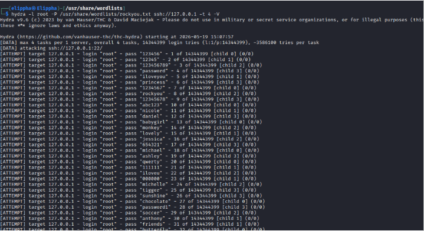
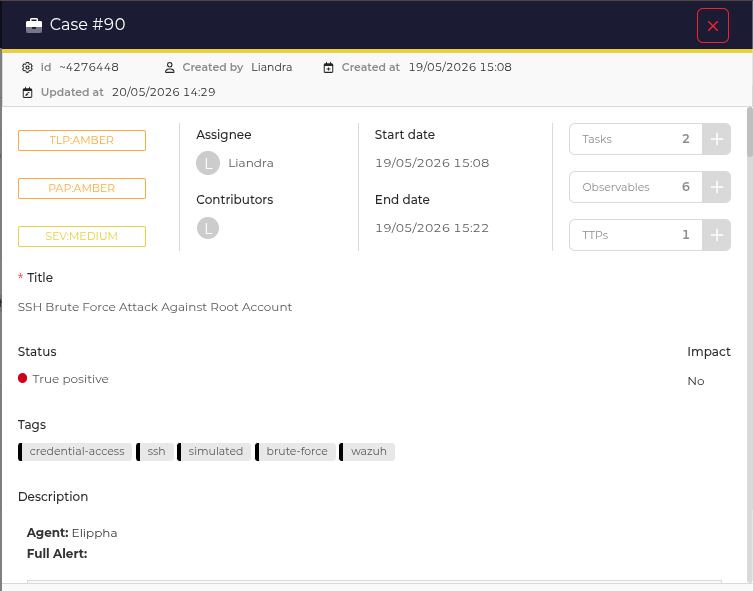

# 🛡️ SOC Home Lab: Wazuh + TheHive Threat Detection & Incident Response


> A fully functional SOC home lab built on Kali Linux, using Wazuh as the SIEM/XDR platform and TheHive for case management and incident reporting — with real attack simulations and documented incident reports.

---

## 📋 Table of Contents

- [Overview](#overview)
- [Architecture](#architecture)
- [Prerequisites](#prerequisites)
- [Part 1: Wazuh Installation](#part-1-wazuh-installation)
- [Part 2: Adding Agents](#part-2-adding-agents)
- [Part 3: TheHive Installation](#part-3-thehive-installation)
- [Part 4: Wazuh + TheHive Integration](#part-4-wazuh--thehive-integration)
- [Part 5: SOC Workflow](#part-5-soc-workflow)
- [Part 6: Incident Reports](#part-6-incident-reports)
- [Key Takeaways](#key-takeaways)

---

## Overview

This project documents my journey building a SOC home lab from scratch. The goal was to simulate a real Security Operations Center environment where:

- **Wazuh** monitors endpoints and generates alerts
- **TheHive** receives those alerts as cases for investigation
- A SOC analyst (me) investigates, documents, and closes each case

This is not just a setup guide it includes **real incident reports** from alerts I investigated, including false positives and a simulated brute force attack.

---

## Architecture

```
┌─────────────────────────────────────────────────────┐
│                   Kali Linux                        │
│                                                     │
│   ┌─────────────┐        ┌──────────────────────┐  │
│   │   Wazuh     │──────▶ │      TheHive          │  │
│   │   Manager   │  HTTP  │   (Docker Container)  │  │
│   │   + Dashboard│       │   Port 9000           │  │
│   └──────┬──────┘        └──────────────────────┘  │
│          │                                          │
└──────────┼──────────────────────────────────────────┘
           │ Wazuh Agent (port 1514)
           │
    ┌──────┴───────────────────────┐
    │                              │
┌───▼──────────┐       ┌──────────▼───────┐
│  Kali Linux  │       │  Windows Machine  │
│  Agent 000   │       │  Agent 006        │
│  (Elippha)   │       │  (Estelle)        │
└──────────────┘       └──────────────────┘
```

### Wazuh Dashboard — Active Agents


---

## Prerequisites

| Tool | Purpose |
|---|---|
| Kali Linux | SOC workstation + Wazuh Manager |
| Windows PC | Monitored endpoint |
| Docker + Docker Compose | Running TheHive + Cassandra |
| Python 3 | Wazuh-TheHive integration script |
| Hydra | Attack simulation (brute force) |

---

## Part 1: Wazuh Installation

### Install Wazuh (All-in-One)

```bash
curl -sO https://packages.wazuh.com/4.x/wazuh-install.sh
sudo bash ./wazuh-install.sh -a
```

If you encounter errors:

```bash
rm wazuh-install.sh
wget https://packages.wazuh.com/4.9/wazuh-install.sh
chmod +x wazuh-install.sh
sudo bash ./wazuh-install.sh
```

> ⏱️ Installation takes 10–20 minutes. At completion you will see your dashboard **username and password** — save these immediately.

### Access the Dashboard

```
https://your-kali-ip-address
```

---

## Part 2: Adding Agents

### Windows Agent Setup

**On the Wazuh Dashboard:**
1. Go to **Agents → Deploy New Agent**
2. Select **Windows**, assign a name, enter agent IP
3. Follow the on-screen steps

**On Windows (CMD as Administrator):**

```cmd
msiexec.exe /i C:\wazuh-agent.msi
Get-Service -Name "WazuhSvc"
notepad "C:\Program Files (x86)\ossec-agent\ossec.conf"
```

Update the config:

```xml
<enrollment>
  <agent_name>YOUR-AGENT-NAME</agent_name>
</enrollment>

<client>
  <server>
    <address>YOUR.WAZUH.SERVER.IP</address>
    <port>1514</port>
    <protocol>tcp</protocol>
  </server>
</client>
```

Restart the agent:

```cmd
NET STOP WazuhSvc
NET START WazuhSvc
Get-Service -Name "WazuhSvc"
```

---

## Part 3: TheHive Installation

TheHive runs via Docker alongside Cassandra as its database.

### Install Docker Compose

```bash
sudo apt update
sudo apt install docker-compose -y
```

### Create Working Directory

```bash
mkdir ~/thehive-setup && cd ~/thehive-setup
nano docker-compose.yml
```

### docker-compose.yml

```yaml
services:
  cassandra:
    image: cassandra:4
    container_name: cassandra
    hostname: cassandra
    environment:
      - CASSANDRA_CLUSTER_NAME=thp
    volumes:
      - cassandra_data:/var/lib/cassandra
    restart: unless-stopped
    healthcheck:
      test: ["CMD", "cqlsh", "-e", "describe keyspaces"]
      interval: 30s
      timeout: 10s
      retries: 10

  thehive:
    image: strangebee/thehive:5.2.8-1
    container_name: thehive
    hostname: thehive
    depends_on:
      cassandra:
        condition: service_healthy
    ports:
      - "9000:9000"
    environment:
      - TH_NO_CONFIG_CORTEX=true
    command:
      - --cql-hostnames
      - cassandra
    restart: unless-stopped

volumes:
  cassandra_data:
```

### Start TheHive

```bash
docker-compose pull
docker-compose up -d
docker-compose logs -f thehive
```

Wait for:
```
Listening for HTTP on /0.0.0.0:9000
```

### Access TheHive

```
http://localhost:9000
```

Default login: `admin@thehive.local` / `secret`

If you encounter login errors:

```bash
docker exec -it thehive bash

curl -XPOST -H "Content-Type: application/json" \
  http://localhost:9000/api/login \
  -d '{"user":"admin@thehive.local","password":"secret"}'
```

### Initial Setup

1. Change the default password immediately
2. **Admin → Organisations → New Organisation** (e.g. `SOC-Team`)
3. **Admin → Users → New User** (Profile: `org-admin`)
4. **Admin → Users → your user → Create API Key** — copy and save it

---

## Part 4: Wazuh + TheHive Integration

### Create the Integration Script

```bash
sudo mkdir -p /var/ossec/integrations/
sudo nano /var/ossec/integrations/custom-thehive
```

```python
#!/usr/bin/env python3
import sys
import json
import requests
from datetime import datetime

THEHIVE_URL = "http://localhost:9000"
THEHIVE_API_KEY = "your-api-key-here"  # paste your TheHive API key

def create_case(alert):
    headers = {
        "Authorization": f"Bearer {THEHIVE_API_KEY}",
        "Content-Type": "application/json"
    }
    severity = map_severity(alert.get('rule', {}).get('level', 1))
    case = {
        "title": f"Wazuh Alert: {alert.get('rule', {}).get('description', 'Unknown')}",
        "description": f"**Agent:** {alert.get('agent', {}).get('name', 'Unknown')}\n\n**Full Alert:**\n```\n{json.dumps(alert, indent=2)}\n```",
        "severity": severity,
        "tags": ["wazuh", "auto-generated"],
        "startDate": int(datetime.now().timestamp() * 1000)
    }
    r = requests.post(f"{THEHIVE_URL}/api/case", headers=headers, json=case)
    if r.status_code == 201:
        print(f"Case created successfully: {r.json().get('_id')}")
    else:
        print(f"Failed to create case: {r.status_code} - {r.text}")

def map_severity(level):
    if level >= 12: return 3   # High
    elif level >= 7: return 2  # Medium
    else: return 1             # Low

if __name__ == "__main__":
    try:
        with open(sys.argv[1]) as f:
            alert = json.load(f)
        create_case(alert)
    except Exception as e:
        print(f"Error: {e}")
        sys.exit(1)
```

### Set Permissions

```bash
sudo chmod 755 /var/ossec/integrations/custom-thehive
sudo chown root:wazuh /var/ossec/integrations/custom-thehive
```

### Configure Wazuh

```bash
sudo nano /var/ossec/etc/ossec.conf
```

Add before `</ossec_config>`:

```xml
<integration>
  <name>custom-thehive</name>
  <level>7</level>
  <alert_format>json</alert_format>
</integration>
```

```bash
sudo systemctl restart wazuh-manager
```

### Test the Integration

```bash
echo '{"rule":{"level":8,"description":"Test alert"},"agent":{"name":"test-agent"}}' > /tmp/test-alert.json
sudo python3 /var/ossec/integrations/custom-thehive /tmp/test-alert.json
# Expected: Case created successfully: ~123456789
```

---

## Part 5: SOC Workflow

```
Wazuh detects a threat
         ↓
Alert auto-creates a case in TheHive
         ↓
SOC Analyst opens the case → investigates
         ↓
Analyst writes notes, tasks, and observables
         ↓
Endpoint isolated via Wazuh Active Response (if needed)
         ↓
Threat remediated / vulnerability patched
         ↓
Case marked Resolved in TheHive
         ↓
Wazuh rescans → alert count drops
```

### TheHive — Cases List


---

## Part 6: Incident Reports

### 🔵 Case 18 — Suspected Trojaned Binary: `/bin/chfn`

| Field | Value |
|---|---|
| **Agent** | Elippha (Kali Linux) |
| **Rule ID** | 510 |
| **Level** | 7 |
| **Detection** | rootcheck |
| **Resolution** | False Positive |

**Alert:**
> Trojaned version of file `/bin/chfn` detected. Signature: `bash|file.h|proc.h|/dev/ttyo` (Generic)

**Investigation Commands:**

```bash
sha256sum /bin/chfn
# 05b4080b07f8fb9ce120d8e4e286676413698eabfc6f69ad8cd8d63c20c8f156

dpkg -S /bin/chfn
# no path found — not tracked by dpkg

ls -la /bin/chfn
# -rwsr-xr-x 1 root root 70888 Sep 17 2025

strings /bin/chfn | grep -E "bash|/dev/|proc\.h|file\.h"
# /dev/null

stat /bin/chfn
# Modified: 2025-09-17 | Changed: 2025-10-29
```

**Findings:**
- Only match was `/dev/null` — a normal system reference in legitimate binaries
- SUID bit set as expected for `chfn`
- Timestamps consistent with system install date
- Not tracked by dpkg — common on Kali Linux for certain system utilities

**Conclusion:** ✅ FALSE POSITIVE — Wazuh rootcheck signature triggered on a benign pattern match.

**Remediation:**
```bash
# Whitelist in rootcheck
sudo nano /var/ossec/etc/shared/default/rootcheck.conf
# Add: !/bin/chfn

sudo systemctl restart wazuh-manager
```

---

### 🔴 Case 90 — SSH Brute Force Attack Against Root Account

| Field | Value |
|---|---|
| **Agent** | Elippha (Kali Linux) |
| **Rule ID** | 5763 |
| **Level** | 10 |
| **MITRE** | T1110 — Brute Force |
| **Tactic** | Credential Access |
| **Resolution** | True Positive (Simulated) |

**Attack Simulation:**

```bash
hydra -l root -P /usr/share/wordlists/rockyou.txt ssh://127.0.0.1 -t 4 -V
```

### Hydra Brute Force Running



**Attack Timeline:**

| Time | Event |
|---|---|
| 15:07:57 | Hydra launched — 14,344,399 passwords in queue |
| 12:07:18 | First failed SSH attempts — ports 39464, 39480 |
| 12:07:21 | Second wave — ports 39464, 39480, 39496 |
| 12:07:24 | Third wave — ports 39464, 39480 |
| 12:08:02 | Wazuh Rule 5763 triggered |
| 15:08:03 | Case auto-created in TheHive |

**Passwords Attempted (sample):**

```
123456, password, iloveyou, qwerty, abc123,
monkey, sunshine, chocolate, 111111, iloveu
(36 attempts captured before simulation stopped)
```

**Compliance Frameworks Triggered:**

| Framework | Controls |
|---|---|
| PCI DSS | 11.4, 10.2.4, 10.2.5 |
| GDPR | IV_35.7.d, IV_32.2 |
| HIPAA | 164.312.b |
| NIST 800-53 | SI.4, AU.14, AC.7 |

**Findings:**
- All 36 attempts failed — root account not compromised
- Wazuh detected the attack within **6 seconds** of it starting
- Rule 5763 fired 6 times indicating a sustained attack pattern

### TheHive — Case 90 Detail



**Conclusion:** ⚠️ TRUE POSITIVE (Simulated) — Detection worked correctly.

**Remediation Applied:**

```bash
# Disable root SSH login
sudo nano /etc/ssh/sshd_config
# Set: PermitRootLogin no
# Set: PasswordAuthentication no

sudo systemctl restart ssh

# Install fail2ban to auto-block brute force IPs
sudo apt install fail2ban -y
```

---

## Key Takeaways

- **Wazuh detects fast** — brute force was caught within 6 seconds
- **Not every alert is malicious** — false positive investigation is a critical SOC skill
- **Custom rules need careful logic** — two custom rules were found mislabeled during this lab
- **TheHive closes the loop** — from detection to documentation to resolution in one workflow
- **Compliance mapping is automatic** — Wazuh maps alerts to PCI DSS, GDPR, HIPAA, NIST out of the box

---

## What's Next

- [ ] Set up Wazuh Active Response to auto-block brute force IPs
- [ ] Integrate Cortex with TheHive for automated CVE enrichment
- [ ] Add more agents (Linux servers, cloud VMs)
- [ ] Simulate lateral movement and data exfiltration scenarios
- [ ] Build a custom detection rule library

---

## Resources

- [Wazuh Documentation](https://documentation.wazuh.com)
- [TheHive Project](https://thehive-project.org)
- [MITRE ATT&CK Framework](https://attack.mitre.org)
- [Hydra by THC](https://github.com/vanhauser-thc/thc-hydra)
- [Docker Documentation](https://docs.docker.com)

---

## ⚠️ Disclaimer

All attack simulations were conducted in a **controlled lab environment** on machines I own. Never run these tools against systems you do not have explicit written permission to test. This project is for educational purposes only.

---

*If this helped you, consider giving it a ⭐ — and feel free to open an issue or PR if you spot improvements!*
